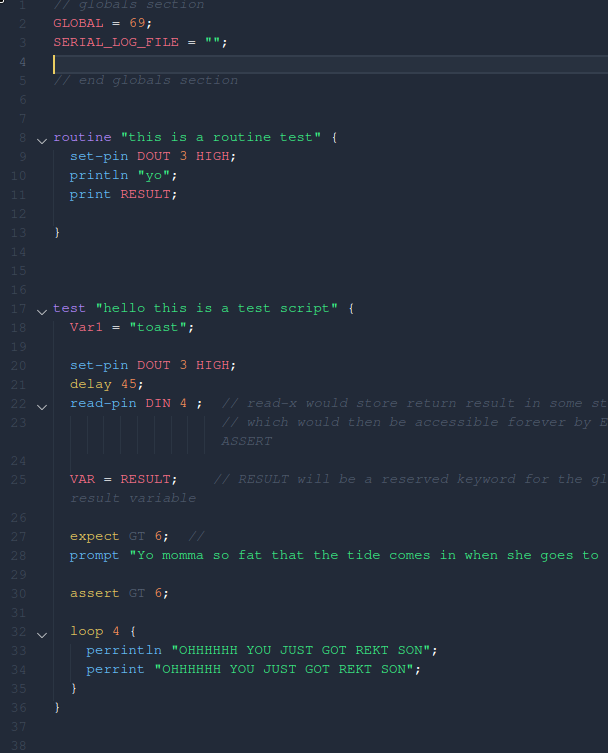

# pers README

You can find the language specifications on [Confluence]( http://confluence.purdueelectricracing.com)

## Features

Provides rudimentary syntax highlighting for the Purdue Electric Racing Scripting language in Visual Studio Code.

## Installation
Locate where your system installs vscode extensions (e.g. `~/.vscode/extensions`).
Assuming your `extensions` directory is in  `~/.vscode/extensions`, perform the following commands.

`cd <path to your .vscode>/extensions`
`git clone https://github.com/PurdueElectricRacing/pers-syntax-highlighting.git`

Congratulations, you have now installed the syntax highlighter. Enjoy.

## Known Issues
None yet

## Prerequisites
Git
Visual Studio Code

